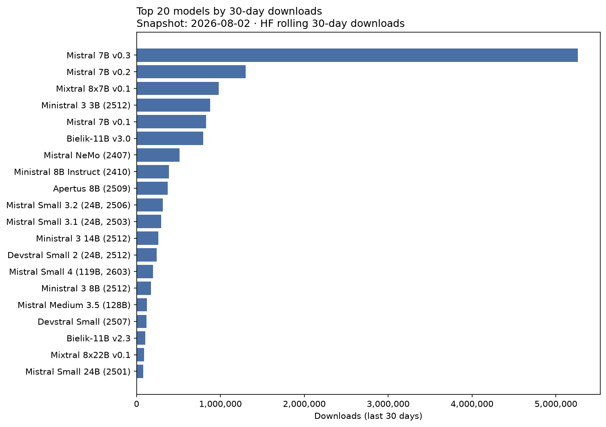
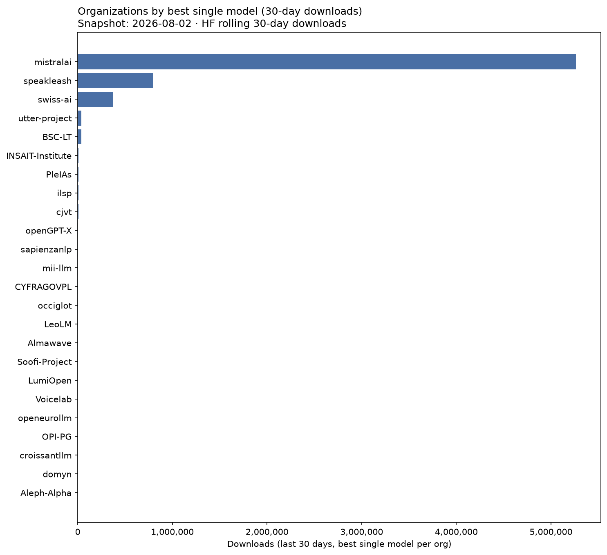

# European LLM Hugging Face download leaderboard

- **Snapshot date:** 2026-08-02
- **Generated at:** 2026-08-02T14:49:07Z
- **Ranking metric:** `total_downloads_30d` (last 30 days, summed across official format variants)
- **Rows:** 154

| Rank | Model | Country | Developer | Org | Downloads (30d) | Δ 30d | All-time | Momentum | Params | Repos |
| ---: | --- | :---: | --- | --- | ---: | ---: | ---: | ---: | ---: | ---: |
| 1 | Mistral 7B v0.3 | FR | Mistral AI | [mistralai](https://huggingface.co/mistralai) | 5,263,920 | — | 51,645,283 | 10.2% | 7.25B | 2 |
| 2 | Mistral 7B v0.2 | FR | Mistral AI | [mistralai](https://huggingface.co/mistralai) | 1,300,119 | — | 61,685,581 | 2.1% | 7.24B | 1 |
| 3 | Mixtral 8x7B v0.1 | FR | Mistral AI | [mistralai](https://huggingface.co/mistralai) | 980,982 | — | 31,690,759 | 3.1% | 46.70B | 2 |
| 4 | Ministral 3 3B (2512) | FR | Mistral AI | [mistralai](https://huggingface.co/mistralai) | 875,569 | — | 4,763,737 | 18.0% | 4.25B | 7 |
| 5 | Mistral 7B v0.1 | FR | Mistral AI | [mistralai](https://huggingface.co/mistralai) | 828,187 | — | 44,558,788 | 1.9% | 7.24B | 2 |
| 6 | Bielik-11B v3.0 | PL | SpeakLeash / ACK Cyfronet AGH | [speakleash](https://huggingface.co/speakleash) | 796,453 | — | 3,696,909 | 21.0% | 11.34B | 8 |
| 7 | Mistral NeMo (2407) | FR | Mistral AI | [mistralai](https://huggingface.co/mistralai) | 513,302 | — | 15,317,032 | 3.3% | 12.25B | 3 |
| 8 | Ministral 8B Instruct (2410) | FR | Mistral AI | [mistralai](https://huggingface.co/mistralai) | 384,247 | — | 8,061,931 | 4.7% | 8.02B | 1 |
| 9 | Apertus 8B (2509) | CH | swiss-ai | [swiss-ai](https://huggingface.co/swiss-ai) | 373,430 | — | 3,072,054 | 11.8% | 8.05B | 2 |
| 10 | Mistral Small 3.2 (24B, 2506) | FR | Mistral AI | [mistralai](https://huggingface.co/mistralai) | 313,608 | — | 5,036,211 | 6.1% | 24.01B | 1 |
| 11 | Mistral Small 3.1 (24B, 2503) | FR | Mistral AI | [mistralai](https://huggingface.co/mistralai) | 294,892 | — | 4,059,150 | 7.1% | 24.01B | 2 |
| 12 | Ministral 3 14B (2512) | FR | Mistral AI | [mistralai](https://huggingface.co/mistralai) | 258,648 | — | 2,765,355 | 9.0% | 13.95B | 6 |
| 13 | Devstral Small 2 (24B, 2512) | FR | Mistral AI | [mistralai](https://huggingface.co/mistralai) | 238,042 | — | 2,294,047 | 9.9% | 24.01B | 1 |
| 14 | Mistral Small 4 (119B, 2603) | FR | Mistral AI | [mistralai](https://huggingface.co/mistralai) | 194,772 | — | 544,398 | 30.2% | 119.40B | 3 |
| 15 | Ministral 3 8B (2512) | FR | Mistral AI | [mistralai](https://huggingface.co/mistralai) | 170,842 | — | 1,711,990 | 9.4% | 8.92B | 6 |
| 16 | Mistral Medium 3.5 (128B) | FR | Mistral AI | [mistralai](https://huggingface.co/mistralai) | 122,190 | — | 871,330 | 12.6% | 127.70B | 2 |
| 17 | Devstral Small (2507) | FR | Mistral AI | [mistralai](https://huggingface.co/mistralai) | 119,526 | — | 544,946 | 18.5% | 23.57B | 2 |
| 18 | Bielik-11B v2.3 | PL | SpeakLeash / ACK Cyfronet AGH | [speakleash](https://huggingface.co/speakleash) | 104,826 | — | 746,323 | 12.4% | 11.25B | 10 |
| 19 | Mixtral 8x22B v0.1 | FR | Mistral AI | [mistralai](https://huggingface.co/mistralai) | 87,952 | — | 11,112,732 | 0.8% | 140.63B | 2 |
| 20 | Mistral Small 24B (2501) | FR | Mistral AI | [mistralai](https://huggingface.co/mistralai) | 78,925 | — | 7,454,689 | 1.0% | 23.57B | 2 |
| 21 | Devstral 2 (123B, 2512) | FR | Mistral AI | [mistralai](https://huggingface.co/mistralai) | 56,009 | — | 318,996 | 13.4% | 125.03B | 1 |
| 22 | Magistral Small (2506) | FR | Mistral AI | [mistralai](https://huggingface.co/mistralai) | 41,044 | — | 569,648 | 6.1% | 23.57B | 2 |
| 23 | Bielik-Minitron 7B v3.0 | PL | SpeakLeash / ACK Cyfronet AGH | [speakleash](https://huggingface.co/speakleash) | 40,963 | — | 120,027 | 18.6% | 7.48B | 5 |
| 24 | EuroLLM-9B-Instruct | EU | utter-project | [utter-project](https://huggingface.co/utter-project) | 39,439 | — | 445,675 | 7.2% | 9.15B | 1 |
| 25 | Salamandra 7B Instruct | ES | BSC-LT | [BSC-LT](https://huggingface.co/BSC-LT) | 39,433 | — | 620,440 | 5.5% | 7.77B | 8 |
| 26 | Apertus 70B (2509) | CH | swiss-ai | [swiss-ai](https://huggingface.co/swiss-ai) | 39,313 | — | 401,569 | 7.8% | 70.60B | 2 |
| 27 | Magistral Small (2509) | FR | Mistral AI | [mistralai](https://huggingface.co/mistralai) | 35,011 | — | 302,181 | 8.7% | 24.01B | 2 |
| 28 | Codestral 22B v0.1 | FR | Mistral AI | [mistralai](https://huggingface.co/mistralai) | 34,570 | — | 5,119,362 | 0.7% | 22.25B | 1 |
| 29 | EuroLLM-9B-Instruct (2512) | EU | utter-project | [utter-project](https://huggingface.co/utter-project) | 30,643 | — | 87,839 | 16.3% | 9.15B | 1 |
| 30 | Mistral Large Instruct (2411) | FR | Mistral AI | [mistralai](https://huggingface.co/mistralai) | 12,293 | — | 4,908,352 | 0.2% | 122.61B | 1 |
| 31 | Mathstral 7B v0.1 | FR | Mistral AI | [mistralai](https://huggingface.co/mistralai) | 11,147 | — | 5,272,338 | 0.2% | 7.25B | 1 |
| 32 | Mistral Large 3 (675B, 2512) | FR | Mistral AI | [mistralai](https://huggingface.co/mistralai) | 10,637 | — | 46,818 | 7.2% | — | 5 |
| 33 | EuroLLM-1.7B-Instruct | EU | utter-project | [utter-project](https://huggingface.co/utter-project) | 9,790 | — | 660,531 | 1.3% | 1.66B | 1 |
| 34 | Bielik-7B v0.1 | PL | SpeakLeash | [speakleash](https://huggingface.co/speakleash) | 9,268 | — | 487,416 | 1.6% | 7.24B | 8 |
| 35 | EuroLLM-22B-Instruct (2512) | EU | utter-project | [utter-project](https://huggingface.co/utter-project) | 8,144 | — | 192,894 | 2.8% | 22.64B | 1 |
| 36 | MamayLM Gemma 3 12B v2.0 | UA | INSAIT | [INSAIT-Institute](https://huggingface.co/INSAIT-Institute) | 7,814 | — | 14,232 | 6.8% | 12.19B | 2 |
| 37 | EuroLLM-1.7B (base) | EU | utter-project | [utter-project](https://huggingface.co/utter-project) | 7,619 | — | 185,660 | 2.7% | — | 1 |
| 38 | Pleias 3B Preview | FR | PleIAs | [PleIAs](https://huggingface.co/PleIAs) | 7,494 | — | 53,444 | 4.9% | 3.21B | 1 |
| 39 | Pleias 1.2B Preview | FR | PleIAs | [PleIAs](https://huggingface.co/PleIAs) | 7,387 | — | 57,919 | 4.7% | 1.20B | 1 |
| 40 | Pleias 350M Preview | FR | PleIAs | [PleIAs](https://huggingface.co/PleIAs) | 7,360 | — | 59,038 | 4.6% | 353.4M | 1 |
| 41 | Llama-Krikri 8B | GR | ILSP | [ilsp](https://huggingface.co/ilsp) | 6,311 | — | 94,133 | 3.3% | 8.42B | 5 |
| 42 | GaMS3 12B | SI | CJVT UL (Center za jezikovne vire in tehnologije, University of Ljubljana) | [cjvt](https://huggingface.co/cjvt) | 6,217 | — | 56,931 | 4.0% | 11.77B | 4 |
| 43 | Salamandra 2B | ES | BSC-LT | [BSC-LT](https://huggingface.co/BSC-LT) | 5,742 | — | 130,953 | 2.5% | 2.25B | 7 |
| 44 | Mistral Small Instruct (2409) | FR | Mistral AI | [mistralai](https://huggingface.co/mistralai) | 5,644 | — | 5,367,853 | 0.1% | 22.25B | 1 |
| 45 | BgGPT Gemma 3 4B | BG | INSAIT | [INSAIT-Institute](https://huggingface.co/INSAIT-Institute) | 5,540 | — | 12,350 | 4.9% | 4.33B | 3 |
| 46 | Devstral Small (2505) | FR | Mistral AI | [mistralai](https://huggingface.co/mistralai) | 5,499 | — | 896,069 | 0.6% | 23.57B | 2 |
| 47 | Apertus v1.5 8B | CH | swiss-ai | [swiss-ai](https://huggingface.co/swiss-ai) | 5,250 | — | 5,250 | 5.0% | 8.90B | 1 |
| 48 | Mistral Large Instruct (2407) | FR | Mistral AI | [mistralai](https://huggingface.co/mistralai) | 5,027 | — | 5,021,762 | 0.1% | 122.61B | 1 |
| 49 | Teuken 7B v0.6 | DE | openGPT-X | [openGPT-X](https://huggingface.co/openGPT-X) | 4,767 | — | 660,351 | 0.6% | 7.45B | 2 |
| 50 | Minerva 7B v1.0 | IT | SapienzaNLP | [sapienzanlp](https://huggingface.co/sapienzanlp) | 4,742 | — | 123,338 | 2.1% | 7.40B | 3 |
| 51 | Apertus v1.5 70B | CH | swiss-ai | [swiss-ai](https://huggingface.co/swiss-ai) | 4,606 | — | 4,606 | 4.4% | 72.01B | 1 |
| 52 | Maestrale Chat v0.4 | IT | mii-llm | [mii-llm](https://huggingface.co/mii-llm) | 4,417 | — | 141,617 | 1.8% | 7.24B | 4 |
| 53 | Bielik-4.5B v3.0 | PL | SpeakLeash | [speakleash](https://huggingface.co/speakleash) | 3,827 | — | 246,146 | 1.1% | 4.76B | 5 |
| 54 | Llama-PLLuM 70B (2512) | PL | CYFRAGOVPL / PLLuM consortium | [CYFRAGOVPL](https://huggingface.co/CYFRAGOVPL) | 3,632 | — | 10,946 | 3.3% | 70.55B | 2 |
| 55 | Occiglot 7B (bilingual) | EU | occiglot | [occiglot](https://huggingface.co/occiglot) | 3,582 | — | 363,908 | 0.8% | 7.24B | 8 |
| 56 | Bielik-1.5B v3.0 | PL | SpeakLeash | [speakleash](https://huggingface.co/speakleash) | 3,520 | — | 49,339 | 2.4% | 1.60B | 5 |
| 57 | Monad | FR | PleIAs | [PleIAs](https://huggingface.co/PleIAs) | 3,371 | — | 30,055 | 2.6% | 56.7M | 1 |
| 58 | LeoLM HessianAI 7B | DE | LeoLM | [LeoLM](https://huggingface.co/LeoLM) | 3,239 | — | 798,104 | 0.4% | — | 3 |
| 59 | Velvet 14B | IT | Almawave | [Almawave](https://huggingface.co/Almawave) | 3,110 | — | 60,442 | 1.9% | 14.08B | 1 |
| 60 | Zagreus 0.4B (ITA) | IT | mii-llm | [mii-llm](https://huggingface.co/mii-llm) | 2,974 | — | 3,663 | 2.9% | 437.8M | 1 |
| 61 | Velvet 2B | IT | Almawave | [Almawave](https://huggingface.co/Almawave) | 2,933 | — | 81,439 | 1.6% | 2.22B | 1 |
| 62 | Apertus v1.1 0.5B | CH | swiss-ai | [swiss-ai](https://huggingface.co/swiss-ai) | 2,845 | — | 6,953 | 2.7% | 572.6M | 5 |
| 63 | Bielik-11B v2.2 | PL | SpeakLeash / ACK Cyfronet AGH | [speakleash](https://huggingface.co/speakleash) | 2,838 | — | 155,019 | 1.1% | 11.17B | 16 |
| 64 | Minerva Chat v0.1 | IT | mii-llm | [mii-llm](https://huggingface.co/mii-llm) | 2,791 | — | 84,317 | 1.5% | 2.89B | 1 |
| 65 | Bielik-11B v2.6 | PL | SpeakLeash / ACK Cyfronet AGH | [speakleash](https://huggingface.co/speakleash) | 2,632 | — | 169,950 | 1.0% | 11.51B | 7 |
| 66 | EuroLLM-22B (2512 base) | EU | utter-project | [utter-project](https://huggingface.co/utter-project) | 2,477 | — | 18,586 | 2.1% | 22.64B | 1 |
| 67 | PLLuM 12B (2412) | PL | CYFRAGOVPL / PLLuM consortium | [CYFRAGOVPL](https://huggingface.co/CYFRAGOVPL) | 2,310 | — | 173,186 | 0.8% | 12.25B | 6 |
| 68 | EuroMoE 2.6B-A0.6B (2512) | EU | utter-project | [utter-project](https://huggingface.co/utter-project) | 2,240 | — | 30,066 | 1.7% | 2.61B | 3 |
| 69 | BgGPT Gemma 3 12B | BG | INSAIT | [INSAIT-Institute](https://huggingface.co/INSAIT-Institute) | 2,127 | — | 215,807 | 0.7% | 12.19B | 3 |
| 70 | Teuken 7B v0.4 (research) | DE | openGPT-X | [openGPT-X](https://huggingface.co/openGPT-X) | 2,005 | — | 74,423 | 1.1% | 7.45B | 1 |
| 71 | GaMS 9B | SI | CJVT UL (Center za jezikovne vire in tehnologije, University of Ljubljana) | [cjvt](https://huggingface.co/cjvt) | 1,857 | — | 45,576 | 1.3% | 9.24B | 4 |
| 72 | Baguettotron | FR | PleIAs | [PleIAs](https://huggingface.co/PleIAs) | 1,814 | — | 34,703 | 1.3% | 321.0M | 2 |
| 73 | Soofi S Instruct Preview | DE | Soofi Project | [Soofi-Project](https://huggingface.co/Soofi-Project) | 1,783 | — | 6,140 | 1.7% | 31.59B | 6 |
| 74 | Teuken 7B v0.4 (commercial) | DE | openGPT-X | [openGPT-X](https://huggingface.co/openGPT-X) | 1,753 | — | 102,644 | 0.9% | 7.45B | 1 |
| 75 | Apertus v1.1 4B | CH | swiss-ai | [swiss-ai](https://huggingface.co/swiss-ai) | 1,747 | — | 4,487 | 1.7% | 3.83B | 5 |
| 76 | Llama-Poro 2 8B | FI | LumiOpen | [LumiOpen](https://huggingface.co/LumiOpen) | 1,696 | — | 38,524 | 1.2% | 8.03B | 7 |
| 77 | BgGPT 7B v0.2 | BG | INSAIT | [INSAIT-Institute](https://huggingface.co/INSAIT-Institute) | 1,693 | — | 104,178 | 0.8% | 7.29B | 2 |
| 78 | EuroLLM-22B-Instruct (Preview) | EU | utter-project | [utter-project](https://huggingface.co/utter-project) | 1,683 | — | 29,240 | 1.3% | 22.64B | 1 |
| 79 | TRURL 2 7B | PL | Voicelab | [Voicelab](https://huggingface.co/Voicelab) | 1,655 | — | 298,250 | 0.4% | 6.74B | 2 |
| 80 | PLLuM 4B (2512) | PL | CYFRAGOVPL / PLLuM consortium | [CYFRAGOVPL](https://huggingface.co/CYFRAGOVPL) | 1,644 | — | 3,875 | 1.6% | 4.30B | 3 |
| 81 | MamayLM Gemma 2 9B v0.1 | UA | INSAIT | [INSAIT-Institute](https://huggingface.co/INSAIT-Institute) | 1,641 | — | 20,860 | 1.4% | 9.24B | 2 |
| 82 | OpenEuroLLM Prelude | EU | openeurollm | [openeurollm](https://huggingface.co/openeurollm) | 1,633 | — | 1,633 | 1.6% | — | 1 |
| 83 | Qra 1B | PL | OPI-PG | [OPI-PG](https://huggingface.co/OPI-PG) | 1,628 | — | 154,792 | 0.6% | 1.10B | 1 |
| 84 | TRURL 2 13B | PL | Voicelab | [Voicelab](https://huggingface.co/Voicelab) | 1,627 | — | 352,888 | 0.4% | — | 3 |
| 85 | Qra 13B | PL | OPI-PG | [OPI-PG](https://huggingface.co/OPI-PG) | 1,510 | — | 142,670 | 0.6% | 13.02B | 1 |
| 86 | Qra 7B | PL | OPI-PG | [OPI-PG](https://huggingface.co/OPI-PG) | 1,500 | — | 181,855 | 0.5% | 6.74B | 1 |
| 87 | Maestrale Chat v0.3 | IT | mii-llm | [mii-llm](https://huggingface.co/mii-llm) | 1,429 | — | 50,573 | 0.9% | 7.24B | 5 |
| 88 | Maestrale Chat v0.2 | IT | mii-llm | [mii-llm](https://huggingface.co/mii-llm) | 1,386 | — | 49,577 | 0.9% | 7.24B | 1 |
| 89 | MamayLM Gemma 3 27B v2.0 | UA | INSAIT | [INSAIT-Institute](https://huggingface.co/INSAIT-Institute) | 1,348 | — | 4,859 | 1.3% | 28.84B | 3 |
| 90 | Apertus v1.1 1.5B | CH | swiss-ai | [swiss-ai](https://huggingface.co/swiss-ai) | 1,305 | — | 3,862 | 1.3% | 1.51B | 6 |
| 91 | Magistral Small (2507) | FR | Mistral AI | [mistralai](https://huggingface.co/mistralai) | 1,243 | — | 148,730 | 0.5% | 23.57B | 2 |
| 92 | PLLuM 12B (2512) | PL | CYFRAGOVPL / PLLuM consortium | [CYFRAGOVPL](https://huggingface.co/CYFRAGOVPL) | 1,131 | — | 16,260 | 1.0% | 12.25B | 3 |
| 93 | Salamandra 7B (base) | ES | BSC-LT | [BSC-LT](https://huggingface.co/BSC-LT) | 1,122 | — | 46,295 | 0.8% | 7.77B | 1 |
| 94 | CroissantLLM Base | FR | croissantllm | [croissantllm](https://huggingface.co/croissantllm) | 1,101 | — | 55,107 | 0.7% | 1.35B | 3 |
| 95 | Soofi S Rhine Preview | DE | Soofi Project | [Soofi-Project](https://huggingface.co/Soofi-Project) | 1,061 | — | 1,417 | 1.0% | 31.59B | 6 |
| 96 | Domyn Small v1.0 | IT | Domyn | [domyn](https://huggingface.co/domyn) | 976 | — | 4,451 | 0.9% | 9.82B | 1 |
| 97 | Llama-PLLuM 8B (2512) | PL | CYFRAGOVPL / PLLuM consortium | [CYFRAGOVPL](https://huggingface.co/CYFRAGOVPL) | 938 | — | 2,323 | 0.9% | 8.03B | 3 |
| 98 | MamayLM Gemma 3 4B v1.0 | UA | INSAIT | [INSAIT-Institute](https://huggingface.co/INSAIT-Institute) | 892 | — | 16,374 | 0.8% | 4.30B | 2 |
| 99 | Llama-PLLuM 8B (2412) | PL | CYFRAGOVPL / PLLuM consortium | [CYFRAGOVPL](https://huggingface.co/CYFRAGOVPL) | 749 | — | 69,022 | 0.4% | 8.03B | 3 |
| 100 | CroissantLLM Chat v0.1 | FR | croissantllm | [croissantllm](https://huggingface.co/croissantllm) | 704 | — | 93,461 | 0.4% | 1.35B | 8 |
| 101 | Bielik-11B v2.0 | PL | SpeakLeash / ACK Cyfronet AGH | [speakleash](https://huggingface.co/speakleash) | 618 | — | 19,703 | 0.5% | 11.17B | 5 |
| 102 | MamayLM Gemma 3 12B v1.0 | UA | INSAIT | [INSAIT-Institute](https://huggingface.co/INSAIT-Institute) | 607 | — | 41,570 | 0.4% | 12.19B | 2 |
| 103 | Soofi S Isar Preview | DE | Soofi Project | [Soofi-Project](https://huggingface.co/Soofi-Project) | 597 | — | 4,904 | 0.6% | 31.59B | 6 |
| 104 | Nesso 0.4B Agentic | IT | mii-llm | [mii-llm](https://huggingface.co/mii-llm) | 594 | — | 1,913 | 0.6% | 560.9M | 2 |
| 105 | BgGPT Gemma 3 27B | BG | INSAIT | [INSAIT-Institute](https://huggingface.co/INSAIT-Institute) | 586 | — | 5,691 | 0.6% | 27.43B | 3 |
| 106 | EuroLLM-9B (base) | EU | utter-project | [utter-project](https://huggingface.co/utter-project) | 574 | — | 78,827 | 0.3% | 9.15B | 1 |
| 107 | Leanstral 1.5 (119B-A6B) | FR | Mistral AI | [mistralai](https://huggingface.co/mistralai) | 547 | — | 600 | 0.5% | — | 1 |
| 108 | Occiglot 7B EU5 | EU | occiglot | [occiglot](https://huggingface.co/occiglot) | 539 | — | 320,484 | 0.1% | 7.24B | 2 |
| 109 | Meltemi 7B v1.5 | GR | ILSP | [ilsp](https://huggingface.co/ilsp) | 453 | — | 38,199 | 0.3% | 7.48B | 2 |
| 110 | PLLuM 12B nc (2507) | PL | CYFRAGOVPL / PLLuM consortium | [CYFRAGOVPL](https://huggingface.co/CYFRAGOVPL) | 445 | — | 5,845 | 0.4% | 12.25B | 3 |
| 111 | Soofi S Base | DE | Soofi Project | [Soofi-Project](https://huggingface.co/Soofi-Project) | 416 | — | 500 | 0.4% | 31.58B | 1 |
| 112 | PLLuM 8x7B (2412) | PL | CYFRAGOVPL / PLLuM consortium | [CYFRAGOVPL](https://huggingface.co/CYFRAGOVPL) | 404 | — | 27,924 | 0.3% | 46.70B | 6 |
| 113 | ALIA 40B Instruct (2601) | ES | BSC-LT | [BSC-LT](https://huggingface.co/BSC-LT) | 403 | — | 30,724 | 0.3% | 40.43B | 2 |
| 114 | Llama-Poro 2 70B | FI | LumiOpen | [LumiOpen](https://huggingface.co/LumiOpen) | 386 | — | 36,850 | 0.3% | 70.55B | 3 |
| 115 | Bielik-11B v2.1 | PL | SpeakLeash / ACK Cyfronet AGH | [speakleash](https://huggingface.co/speakleash) | 371 | — | 28,095 | 0.3% | 11.17B | 5 |
| 116 | Pharia-1-LLM-7B-control | DE | Aleph Alpha | [Aleph-Alpha](https://huggingface.co/Aleph-Alpha) | 363 | — | 75,144 | 0.2% | 7.04B | 4 |
| 117 | Poro 34B | FI | LumiOpen | [LumiOpen](https://huggingface.co/LumiOpen) | 354 | — | 226,100 | 0.1% | 35.13B | 4 |
| 118 | Meltemi 7B v1 | GR | ILSP | [ilsp](https://huggingface.co/ilsp) | 352 | — | 43,642 | 0.2% | 7.70B | 5 |
| 119 | EuroLLM-9B (2512) | EU | utter-project | [utter-project](https://huggingface.co/utter-project) | 335 | — | 5,450 | 0.3% | 9.15B | 1 |
| 120 | Nesso 4B | IT | mii-llm | [mii-llm](https://huggingface.co/mii-llm) | 331 | — | 1,630 | 0.3% | 4.02B | 2 |
| 121 | ALIA 40B (base) | ES | BSC-LT | [BSC-LT](https://huggingface.co/BSC-LT) | 326 | — | 450,017 | 0.1% | 40.43B | 1 |
| 122 | Nesso 0.4B Instruct | IT | mii-llm | [mii-llm](https://huggingface.co/mii-llm) | 319 | — | 996 | 0.3% | 560.9M | 1 |
| 123 | Pleias Pico | FR | PleIAs | [PleIAs](https://huggingface.co/PleIAs) | 294 | — | 4,970 | 0.3% | 353.4M | 2 |
| 124 | Pleias RAG 1B | FR | PleIAs | [PleIAs](https://huggingface.co/PleIAs) | 266 | — | 17,263 | 0.2% | 1.20B | 2 |
| 125 | GaMS 27B | SI | CJVT UL (Center za jezikovne vire in tehnologije, University of Ljubljana) | [cjvt](https://huggingface.co/cjvt) | 258 | — | 36,200 | 0.2% | 27.23B | 3 |
| 126 | Llama-PLLuM 70B (2412) | PL | CYFRAGOVPL / PLLuM consortium | [CYFRAGOVPL](https://huggingface.co/CYFRAGOVPL) | 245 | — | 38,247 | 0.2% | 70.55B | 3 |
| 127 | Pleias RAG 350M | FR | PleIAs | [PleIAs](https://huggingface.co/PleIAs) | 237 | — | 12,917 | 0.2% | 353.4M | 2 |
| 128 | LeoLM Mistral HessianAI 7B | DE | LeoLM | [LeoLM](https://huggingface.co/LeoLM) | 235 | — | 231,746 | 0.1% | — | 2 |
| 129 | BgGPT Gemma 2 9B | BG | INSAIT | [INSAIT-Institute](https://huggingface.co/INSAIT-Institute) | 231 | — | 26,469 | 0.2% | 9.24B | 2 |
| 130 | BgGPT Gemma 2 2.6B | BG | INSAIT | [INSAIT-Institute](https://huggingface.co/INSAIT-Institute) | 225 | — | 21,120 | 0.2% | 2.61B | 2 |
| 131 | Bielik-11B v2 (base) | PL | SpeakLeash / ACK Cyfronet AGH | [speakleash](https://huggingface.co/speakleash) | 225 | — | 41,064 | 0.2% | 11.17B | 1 |
| 132 | BgGPT 7B v0.1 | BG | INSAIT | [INSAIT-Institute](https://huggingface.co/INSAIT-Institute) | 216 | — | 16,027 | 0.2% | 7.29B | 2 |
| 133 | Viking 7B | FI | LumiOpen | [LumiOpen](https://huggingface.co/LumiOpen) | 187 | — | 50,304 | 0.1% | 7.55B | 1 |
| 134 | OCRonos | FR | PleIAs | [PleIAs](https://huggingface.co/PleIAs) | 178 | — | 79,764 | 0.1% | 8.03B | 3 |
| 135 | Pleias SLM RAG | FR | PleIAs | [PleIAs](https://huggingface.co/PleIAs) | 173 | — | 173 | 0.2% | 321.0M | 1 |
| 136 | LeoLM HessianAI 13B | DE | LeoLM | [LeoLM](https://huggingface.co/LeoLM) | 152 | — | 106,150 | 0.1% | — | 3 |
| 137 | GaMS2 27B | SI | CJVT UL (Center za jezikovne vire in tehnologije, University of Ljubljana) | [cjvt](https://huggingface.co/cjvt) | 147 | — | 277 | 0.1% | 27.23B | 3 |
| 138 | LeoLM HessianAI 70B | DE | LeoLM | [LeoLM](https://huggingface.co/LeoLM) | 138 | — | 19,072 | 0.1% | 68.98B | 2 |
| 139 | GaMS 2B | SI | CJVT UL (Center za jezikovne vire in tehnologije, University of Ljubljana) | [cjvt](https://huggingface.co/cjvt) | 128 | — | 19,032 | 0.1% | 3.20B | 2 |
| 140 | Viking 13B | FI | LumiOpen | [LumiOpen](https://huggingface.co/LumiOpen) | 127 | — | 25,533 | 0.1% | 14.03B | 1 |
| 141 | Viking 33B | FI | LumiOpen | [LumiOpen](https://huggingface.co/LumiOpen) | 108 | — | 23,978 | 0.1% | 33.12B | 1 |
| 142 | Bielik-11B v2.5 | PL | SpeakLeash / ACK Cyfronet AGH | [speakleash](https://huggingface.co/speakleash) | 102 | — | 4,841 | 0.1% | 11.51B | 6 |
| 143 | Leanstral (2603) | FR | Mistral AI | [mistralai](https://huggingface.co/mistralai) | 99 | — | 802 | 0.1% | — | 1 |
| 144 | BgGPT Gemma 2 27B | BG | INSAIT | [INSAIT-Institute](https://huggingface.co/INSAIT-Institute) | 89 | — | 11,203 | 0.1% | 27.23B | 2 |
| 145 | Llama-PLLuM 70B (2508) | PL | CYFRAGOVPL / PLLuM consortium | [CYFRAGOVPL](https://huggingface.co/CYFRAGOVPL) | 76 | — | 4,605 | 0.1% | 70.55B | 3 |
| 146 | Zagreus 0.4B (FRA) | IT | mii-llm | [mii-llm](https://huggingface.co/mii-llm) | 67 | — | 105 | 0.1% | 437.8M | 1 |
| 147 | GaMS 1B | SI | CJVT UL (Center za jezikovne vire in tehnologije, University of Ljubljana) | [cjvt](https://huggingface.co/cjvt) | 63 | — | 15,109 | 0.1% | 1.54B | 4 |
| 148 | Zagreus 0.4B (POR) | IT | mii-llm | [mii-llm](https://huggingface.co/mii-llm) | 47 | — | 138 | 0.0% | 437.8M | 1 |
| 149 | Open Zagreus 0.4B | IT | mii-llm | [mii-llm](https://huggingface.co/mii-llm) | 37 | — | 299 | 0.0% | 437.8M | 1 |
| 150 | Pleias Nano | FR | PleIAs | [PleIAs](https://huggingface.co/PleIAs) | 24 | — | 6,928 | 0.0% | 1.20B | 2 |
| 151 | EuroLLM-22B (Preview base) | EU | utter-project | [utter-project](https://huggingface.co/utter-project) | 19 | — | 2,053 | 0.0% | — | 1 |
| 152 | Maestrale Chat v0.1 | IT | mii-llm | [mii-llm](https://huggingface.co/mii-llm) | 10 | — | 82 | 0.0% | 7.24B | 1 |
| 153 | Emma 5 Boost | IT | mii-llm | [mii-llm](https://huggingface.co/mii-llm) | 8 | — | 8 | 0.0% | 1.39B | 1 |
| 154 | Zagreus 0.4B (SPA) | IT | mii-llm | [mii-llm](https://huggingface.co/mii-llm) | 7 | — | 55 | 0.0% | 437.8M | 1 |

## Organizations

Same downloads, aggregated across every model version an organization publishes.

| Rank | Organization | Developer | Country | Downloads (30d) | All-time | Models | Momentum |
| ---: | --- | --- | :---: | ---: | ---: | ---: | ---: |
| 1 | [mistralai](https://huggingface.co/mistralai) | Mistral AI | FR | 12,244,493 | 282,091,470 | 30 | 4.3% |
| 2 | [speakleash](https://huggingface.co/speakleash) | SpeakLeash / ACK Cyfronet AGH | PL | 965,643 | 5,764,832 | 12 | 16.5% |
| 3 | [swiss-ai](https://huggingface.co/swiss-ai) | swiss-ai | CH | 428,496 | 3,498,781 | 7 | 11.9% |
| 4 | [utter-project](https://huggingface.co/utter-project) | utter-project | EU | 102,963 | 1,736,821 | 11 | 5.6% |
| 5 | [BSC-LT](https://huggingface.co/BSC-LT) | BSC-LT | ES | 47,026 | 1,278,429 | 5 | 3.4% |
| 6 | [PleIAs](https://huggingface.co/PleIAs) | PleIAs | FR | 28,598 | 357,174 | 11 | 6.3% |
| 7 | [INSAIT-Institute](https://huggingface.co/INSAIT-Institute) | INSAIT | UA | 23,009 | 510,740 | 13 | 3.8% |
| 8 | [mii-llm](https://huggingface.co/mii-llm) | mii-llm | IT | 14,417 | 334,973 | 14 | 3.3% |
| 9 | [CYFRAGOVPL](https://huggingface.co/CYFRAGOVPL) | CYFRAGOVPL / PLLuM consortium | PL | 11,574 | 352,233 | 10 | 2.6% |
| 10 | [cjvt](https://huggingface.co/cjvt) | CJVT UL (Center za jezikovne vire in tehnologije, University of Ljubljana) | SI | 8,670 | 173,125 | 6 | 3.2% |
| 11 | [openGPT-X](https://huggingface.co/openGPT-X) | openGPT-X | DE | 8,525 | 837,418 | 3 | 0.9% |
| 12 | [ilsp](https://huggingface.co/ilsp) | ILSP | GR | 7,116 | 175,974 | 3 | 2.6% |
| 13 | [Almawave](https://huggingface.co/Almawave) | Almawave | IT | 6,043 | 141,881 | 2 | 2.5% |
| 14 | [sapienzanlp](https://huggingface.co/sapienzanlp) | SapienzaNLP | IT | 4,742 | 123,338 | 1 | 2.1% |
| 15 | [OPI-PG](https://huggingface.co/OPI-PG) | OPI-PG | PL | 4,638 | 479,317 | 3 | 0.8% |
| 16 | [occiglot](https://huggingface.co/occiglot) | occiglot | EU | 4,121 | 684,392 | 2 | 0.5% |
| 17 | [Soofi-Project](https://huggingface.co/Soofi-Project) | Soofi Project | DE | 3,857 | 12,961 | 4 | 3.4% |
| 18 | [LeoLM](https://huggingface.co/LeoLM) | LeoLM | DE | 3,764 | 1,155,072 | 4 | 0.3% |
| 19 | [Voicelab](https://huggingface.co/Voicelab) | Voicelab | PL | 3,282 | 651,138 | 2 | 0.4% |
| 20 | [LumiOpen](https://huggingface.co/LumiOpen) | LumiOpen | FI | 2,858 | 401,289 | 6 | 0.6% |
| 21 | [croissantllm](https://huggingface.co/croissantllm) | croissantllm | FR | 1,805 | 148,568 | 2 | 0.7% |
| 22 | [openeurollm](https://huggingface.co/openeurollm) | openeurollm | EU | 1,633 | 1,633 | 1 | 1.6% |
| 23 | [domyn](https://huggingface.co/domyn) | Domyn | IT | 976 | 4,451 | 1 | 0.9% |
| 24 | [Aleph-Alpha](https://huggingface.co/Aleph-Alpha) | Aleph Alpha | DE | 363 | 75,144 | 1 | 0.2% |

### By best single model

Ranked by each organization's single highest-downloading model (no summing across versions) — who has the biggest individual hit.

| Rank | Organization | Best model | Downloads (30d) | All-time | Overall model rank |
| ---: | --- | --- | ---: | ---: | ---: |
| 1 | [mistralai](https://huggingface.co/mistralai) | Mistral 7B v0.3 | 5,263,920 | 51,645,283 | 1 |
| 2 | [speakleash](https://huggingface.co/speakleash) | Bielik-11B v3.0 | 796,453 | 3,696,909 | 6 |
| 3 | [swiss-ai](https://huggingface.co/swiss-ai) | Apertus 8B (2509) | 373,430 | 3,072,054 | 9 |
| 4 | [utter-project](https://huggingface.co/utter-project) | EuroLLM-9B-Instruct | 39,439 | 445,675 | 24 |
| 5 | [BSC-LT](https://huggingface.co/BSC-LT) | Salamandra 7B Instruct | 39,433 | 620,440 | 25 |
| 6 | [INSAIT-Institute](https://huggingface.co/INSAIT-Institute) | MamayLM Gemma 3 12B v2.0 | 7,814 | 14,232 | 36 |
| 7 | [PleIAs](https://huggingface.co/PleIAs) | Pleias 3B Preview | 7,494 | 53,444 | 38 |
| 8 | [ilsp](https://huggingface.co/ilsp) | Llama-Krikri 8B | 6,311 | 94,133 | 41 |
| 9 | [cjvt](https://huggingface.co/cjvt) | GaMS3 12B | 6,217 | 56,931 | 42 |
| 10 | [openGPT-X](https://huggingface.co/openGPT-X) | Teuken 7B v0.6 | 4,767 | 660,351 | 49 |
| 11 | [sapienzanlp](https://huggingface.co/sapienzanlp) | Minerva 7B v1.0 | 4,742 | 123,338 | 50 |
| 12 | [mii-llm](https://huggingface.co/mii-llm) | Maestrale Chat v0.4 | 4,417 | 141,617 | 52 |
| 13 | [CYFRAGOVPL](https://huggingface.co/CYFRAGOVPL) | Llama-PLLuM 70B (2512) | 3,632 | 10,946 | 54 |
| 14 | [occiglot](https://huggingface.co/occiglot) | Occiglot 7B (bilingual) | 3,582 | 363,908 | 55 |
| 15 | [LeoLM](https://huggingface.co/LeoLM) | LeoLM HessianAI 7B | 3,239 | 798,104 | 58 |
| 16 | [Almawave](https://huggingface.co/Almawave) | Velvet 14B | 3,110 | 60,442 | 59 |
| 17 | [Soofi-Project](https://huggingface.co/Soofi-Project) | Soofi S Instruct Preview | 1,783 | 6,140 | 73 |
| 18 | [LumiOpen](https://huggingface.co/LumiOpen) | Llama-Poro 2 8B | 1,696 | 38,524 | 76 |
| 19 | [Voicelab](https://huggingface.co/Voicelab) | TRURL 2 7B | 1,655 | 298,250 | 79 |
| 20 | [openeurollm](https://huggingface.co/openeurollm) | OpenEuroLLM Prelude | 1,633 | 1,633 | 82 |
| 21 | [OPI-PG](https://huggingface.co/OPI-PG) | Qra 1B | 1,628 | 154,792 | 83 |
| 22 | [croissantllm](https://huggingface.co/croissantllm) | CroissantLLM Base | 1,101 | 55,107 | 94 |
| 23 | [domyn](https://huggingface.co/domyn) | Domyn Small v1.0 | 976 | 4,451 | 96 |
| 24 | [Aleph-Alpha](https://huggingface.co/Aleph-Alpha) | Pharia-1-LLM-7B-control | 363 | 75,144 | 116 |

### By momentum

Sorted by momentum (highest first). Momentum highlights orgs whose recent downloads are large *relative to their lifetime total* — i.e. accelerating adoption, not legacy long-tail traffic from an old release.

| Momentum rank | Organization | Momentum | Downloads (30d) | All-time | Downloads rank |
| ---: | --- | ---: | ---: | ---: | ---: |
| 1 | [speakleash](https://huggingface.co/speakleash) | 16.5% | 965,643 | 5,764,832 | 2 |
| 2 | [swiss-ai](https://huggingface.co/swiss-ai) | 11.9% | 428,496 | 3,498,781 | 3 |
| 3 | [PleIAs](https://huggingface.co/PleIAs) | 6.3% | 28,598 | 357,174 | 6 |
| 4 | [utter-project](https://huggingface.co/utter-project) | 5.6% | 102,963 | 1,736,821 | 4 |
| 5 | [mistralai](https://huggingface.co/mistralai) | 4.3% | 12,244,493 | 282,091,470 | 1 |
| 6 | [INSAIT-Institute](https://huggingface.co/INSAIT-Institute) | 3.8% | 23,009 | 510,740 | 7 |
| 7 | [Soofi-Project](https://huggingface.co/Soofi-Project) | 3.4% | 3,857 | 12,961 | 17 |
| 8 | [BSC-LT](https://huggingface.co/BSC-LT) | 3.4% | 47,026 | 1,278,429 | 5 |
| 9 | [mii-llm](https://huggingface.co/mii-llm) | 3.3% | 14,417 | 334,973 | 8 |
| 10 | [cjvt](https://huggingface.co/cjvt) | 3.2% | 8,670 | 173,125 | 10 |
| 11 | [ilsp](https://huggingface.co/ilsp) | 2.6% | 7,116 | 175,974 | 12 |
| 12 | [CYFRAGOVPL](https://huggingface.co/CYFRAGOVPL) | 2.6% | 11,574 | 352,233 | 9 |
| 13 | [Almawave](https://huggingface.co/Almawave) | 2.5% | 6,043 | 141,881 | 13 |
| 14 | [sapienzanlp](https://huggingface.co/sapienzanlp) | 2.1% | 4,742 | 123,338 | 14 |
| 15 | [openeurollm](https://huggingface.co/openeurollm) | 1.6% | 1,633 | 1,633 | 22 |
| 16 | [domyn](https://huggingface.co/domyn) | 0.9% | 976 | 4,451 | 23 |
| 17 | [openGPT-X](https://huggingface.co/openGPT-X) | 0.9% | 8,525 | 837,418 | 11 |
| 18 | [OPI-PG](https://huggingface.co/OPI-PG) | 0.8% | 4,638 | 479,317 | 15 |
| 19 | [croissantllm](https://huggingface.co/croissantllm) | 0.7% | 1,805 | 148,568 | 21 |
| 20 | [LumiOpen](https://huggingface.co/LumiOpen) | 0.6% | 2,858 | 401,289 | 20 |
| 21 | [occiglot](https://huggingface.co/occiglot) | 0.5% | 4,121 | 684,392 | 16 |
| 22 | [Voicelab](https://huggingface.co/Voicelab) | 0.4% | 3,282 | 651,138 | 19 |
| 23 | [LeoLM](https://huggingface.co/LeoLM) | 0.3% | 3,764 | 1,155,072 | 18 |
| 24 | [Aleph-Alpha](https://huggingface.co/Aleph-Alpha) | 0.2% | 363 | 75,144 | 24 |

## Notes

- Downloads are Hugging Face Hub **rolling last-30-day** counts, aggregated over official repos matched by config regexes (GGUF / MLX / FP8 / etc. when published by the same org).
- **Params** is the max reported parameter count among member repos (`safetensors.total`, else `gguf.total`).
- **Momentum** = `downloads_30d / (downloads_all_time + 100,000)` — a recency ratio damped by a smoothing constant so low-volume/brand-new rows can't look like they have outsized momentum from a handful of downloads. Higher = more of its lifetime downloads happened in the last 30 days.
- Machine-readable data: [`output/leaderboard.json`](output/leaderboard.json), [`output/leaderboard.csv`](output/leaderboard.csv), [`output/leaderboard_orgs.json`](output/leaderboard_orgs.json), [`output/leaderboard_orgs.csv`](output/leaderboard_orgs.csv).
- How this is built / how to add models: [`DEVELOPMENT.md`](DEVELOPMENT.md).
- This file is regenerated by CI (`fetch` workflow) via `scripts/render_leaderboard_md.py`.
