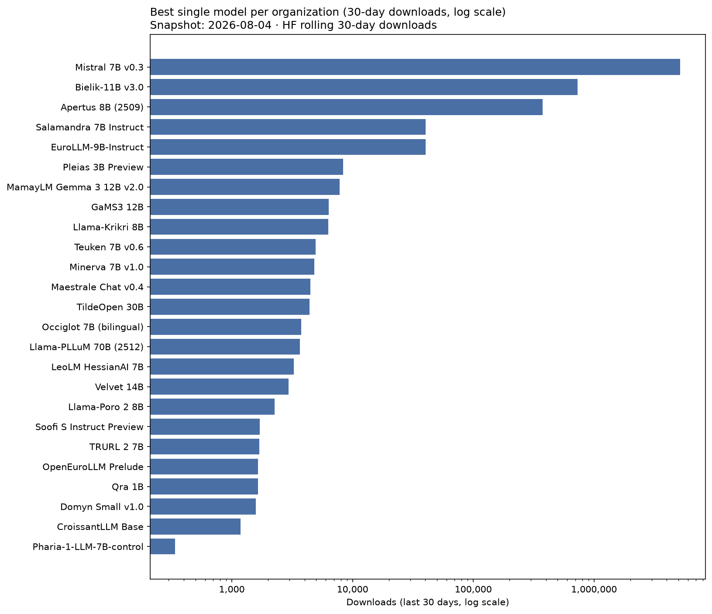

# European LLM Hugging Face download leaderboard

- **Snapshot date:** 2026-08-04
- **Generated at:** 2026-08-04T08:45:08Z
- **Ranking metric:** `total_downloads_30d` (last 30 days, summed across official format variants)
- **Rows:** 158

## Charts

| Rank | Model | Country | Developer | Org | Downloads (30d) | Δ 30d | All-time | Momentum | Params | Repos |
| ---: | --- | :---: | --- | --- | ---: | ---: | ---: | ---: | ---: | ---: |
| 1 | Mistral 7B v0.3 | FR | Mistral AI | [mistralai](https://huggingface.co/mistralai) | 5,175,991 | -71,279 | 51,933,115 | 9.9% | 7.25B | 2 |
| 2 | Mistral 7B v0.2 | FR | Mistral AI | [mistralai](https://huggingface.co/mistralai) | 1,313,050 | +4,780 | 61,758,362 | 2.1% | 7.24B | 1 |
| 3 | Mistral 7B v0.1 | FR | Mistral AI | [mistralai](https://huggingface.co/mistralai) | 922,276 | +75,900 | 44,696,765 | 2.1% | 7.24B | 2 |
| 4 | Mixtral 8x7B v0.1 | FR | Mistral AI | [mistralai](https://huggingface.co/mistralai) | 891,569 | -52,337 | 31,731,454 | 2.8% | 46.70B | 2 |
| 5 | Ministral 3 3B (2512) | FR | Mistral AI | [mistralai](https://huggingface.co/mistralai) | 830,266 | -16,901 | 4,781,009 | 17.0% | 4.25B | 7 |
| 6 | Bielik-11B v3.0 | PL | SpeakLeash / ACK Cyfronet AGH | [speakleash](https://huggingface.co/speakleash) | 733,644 | -29,113 | 3,728,823 | 19.2% | 11.34B | 8 |
| 7 | Mistral NeMo (2407) | FR | Mistral AI | [mistralai](https://huggingface.co/mistralai) | 556,841 | +50,770 | 15,395,849 | 3.6% | 12.25B | 3 |
| 8 | Ministral 8B Instruct (2410) | FR | Mistral AI | [mistralai](https://huggingface.co/mistralai) | 406,941 | +16,379 | 8,094,604 | 5.0% | 8.02B | 1 |
| 9 | Apertus 8B (2509) | CH | swiss-ai | [swiss-ai](https://huggingface.co/swiss-ai) | 376,906 | +2,519 | 3,078,348 | 11.9% | 8.05B | 2 |
| 10 | Mistral Small 3.2 (24B, 2506) | FR | Mistral AI | [mistralai](https://huggingface.co/mistralai) | 314,137 | +1,449 | 5,061,689 | 6.1% | 24.01B | 1 |
| 11 | Mistral Small 3.1 (24B, 2503) | FR | Mistral AI | [mistralai](https://huggingface.co/mistralai) | 299,427 | +3,768 | 4,071,026 | 7.2% | 24.01B | 2 |
| 12 | Ministral 3 14B (2512) | FR | Mistral AI | [mistralai](https://huggingface.co/mistralai) | 272,766 | +7,844 | 2,787,373 | 9.4% | 13.95B | 6 |
| 13 | Devstral Small 2 (24B, 2512) | FR | Mistral AI | [mistralai](https://huggingface.co/mistralai) | 232,736 | -2,586 | 2,295,175 | 9.7% | 24.01B | 1 |
| 14 | Mistral Small 4 (119B, 2603) | FR | Mistral AI | [mistralai](https://huggingface.co/mistralai) | 188,749 | -5,816 | 552,896 | 28.9% | 119.40B | 3 |
| 15 | Ministral 3 8B (2512) | FR | Mistral AI | [mistralai](https://huggingface.co/mistralai) | 159,966 | -5,236 | 1,717,191 | 8.8% | 8.92B | 6 |
| 16 | Devstral Small (2507) | FR | Mistral AI | [mistralai](https://huggingface.co/mistralai) | 120,111 | +269 | 546,178 | 18.6% | 23.57B | 2 |
| 17 | Mistral Medium 3.5 (128B) | FR | Mistral AI | [mistralai](https://huggingface.co/mistralai) | 107,349 | -7,594 | 873,874 | 11.0% | 127.70B | 2 |
| 18 | Bielik-11B v2.3 | PL | SpeakLeash / ACK Cyfronet AGH | [speakleash](https://huggingface.co/speakleash) | 104,505 | -119 | 747,418 | 12.3% | 11.25B | 10 |
| 19 | Mixtral 8x22B v0.1 | FR | Mistral AI | [mistralai](https://huggingface.co/mistralai) | 87,648 | +455 | 11,117,110 | 0.8% | 140.63B | 2 |
| 20 | Mistral Small 24B (2501) | FR | Mistral AI | [mistralai](https://huggingface.co/mistralai) | 78,700 | +459 | 7,458,066 | 1.0% | 23.57B | 2 |
| 21 | Devstral 2 (123B, 2512) | FR | Mistral AI | [mistralai](https://huggingface.co/mistralai) | 52,143 | -1,679 | 319,791 | 12.4% | 125.03B | 1 |
| 22 | Magistral Small (2506) | FR | Mistral AI | [mistralai](https://huggingface.co/mistralai) | 47,253 | +2,883 | 576,315 | 7.0% | 23.57B | 2 |
| 23 | Bielik-Minitron 7B v3.0 | PL | SpeakLeash / ACK Cyfronet AGH | [speakleash](https://huggingface.co/speakleash) | 40,601 | -345 | 120,199 | 18.4% | 7.48B | 5 |
| 24 | Salamandra 7B Instruct | ES | BSC-LT | [BSC-LT](https://huggingface.co/BSC-LT) | 40,431 | +828 | 621,939 | 5.6% | 7.77B | 8 |
| 25 | EuroLLM-9B-Instruct | EU | utter-project | [utter-project](https://huggingface.co/utter-project) | 40,164 | +394 | 446,827 | 7.3% | 9.15B | 1 |
| 26 | Apertus 70B (2509) | CH | swiss-ai | [swiss-ai](https://huggingface.co/swiss-ai) | 39,839 | +341 | 404,308 | 7.9% | 70.60B | 2 |
| 27 | Codestral 22B v0.1 | FR | Mistral AI | [mistralai](https://huggingface.co/mistralai) | 36,761 | +1,182 | 5,122,430 | 0.7% | 22.25B | 1 |
| 28 | Magistral Small (2509) | FR | Mistral AI | [mistralai](https://huggingface.co/mistralai) | 35,214 | +31 | 302,648 | 8.7% | 24.01B | 2 |
| 29 | EuroLLM-9B-Instruct (2512) | EU | utter-project | [utter-project](https://huggingface.co/utter-project) | 26,870 | -327 | 88,751 | 14.2% | 9.15B | 1 |
| 30 | Mistral Large Instruct (2411) | FR | Mistral AI | [mistralai](https://huggingface.co/mistralai) | 12,386 | +92 | 4,908,975 | 0.2% | 122.61B | 1 |
| 31 | Mathstral 7B v0.1 | FR | Mistral AI | [mistralai](https://huggingface.co/mistralai) | 11,567 | +261 | 5,272,767 | 0.2% | 7.25B | 1 |
| 32 | Mistral Large 3 (675B, 2512) | FR | Mistral AI | [mistralai](https://huggingface.co/mistralai) | 11,347 | +569 | 47,633 | 7.7% | — | 5 |
| 33 | EuroLLM-1.7B-Instruct | EU | utter-project | [utter-project](https://huggingface.co/utter-project) | 9,998 | +206 | 661,465 | 1.3% | 1.66B | 1 |
| 34 | Bielik-7B v0.1 | PL | SpeakLeash | [speakleash](https://huggingface.co/speakleash) | 9,558 | +132 | 488,258 | 1.6% | 7.24B | 8 |
| 35 | Pleias 3B Preview | FR | PleIAs | [PleIAs](https://huggingface.co/PleIAs) | 8,345 | +845 | 54,318 | 5.4% | 3.21B | 1 |
| 36 | Pleias 1.2B Preview | FR | PleIAs | [PleIAs](https://huggingface.co/PleIAs) | 8,260 | +877 | 58,815 | 5.2% | 1.20B | 1 |
| 37 | Pleias 350M Preview | FR | PleIAs | [PleIAs](https://huggingface.co/PleIAs) | 8,222 | +860 | 59,928 | 5.1% | 353.4M | 1 |
| 38 | EuroLLM-22B-Instruct (2512) | EU | utter-project | [utter-project](https://huggingface.co/utter-project) | 8,207 | +46 | 193,155 | 2.8% | 22.64B | 1 |
| 39 | MamayLM Gemma 3 12B v2.0 | UA | INSAIT | [INSAIT-Institute](https://huggingface.co/INSAIT-Institute) | 7,787 | 0 | 14,249 | 6.8% | 12.19B | 2 |
| 40 | EuroLLM-1.7B (base) | EU | utter-project | [utter-project](https://huggingface.co/utter-project) | 7,753 | +49 | 186,072 | 2.7% | — | 1 |
| 41 | GaMS3 12B | SI | CJVT UL (Center za jezikovne vire in tehnologije, University of Ljubljana) | [cjvt](https://huggingface.co/cjvt) | 6,339 | +47 | 57,175 | 4.0% | 11.77B | 4 |
| 42 | Llama-Krikri 8B | GR | ILSP | [ilsp](https://huggingface.co/ilsp) | 6,322 | +35 | 94,270 | 3.3% | 8.42B | 5 |
| 43 | Salamandra 2B | ES | BSC-LT | [BSC-LT](https://huggingface.co/BSC-LT) | 6,114 | +202 | 131,867 | 2.6% | 2.25B | 7 |
| 44 | BgGPT Gemma 3 4B | BG | INSAIT | [INSAIT-Institute](https://huggingface.co/INSAIT-Institute) | 5,737 | +235 | 12,621 | 5.1% | 4.33B | 3 |
| 45 | Mistral Small Instruct (2409) | FR | Mistral AI | [mistralai](https://huggingface.co/mistralai) | 5,560 | -51 | 5,368,139 | 0.1% | 22.25B | 1 |
| 46 | Apertus v1.5 8B | CH | swiss-ai | [swiss-ai](https://huggingface.co/swiss-ai) | 5,448 | 0 | 5,448 | 5.2% | 8.90B | 1 |
| 47 | Devstral Small (2505) | FR | Mistral AI | [mistralai](https://huggingface.co/mistralai) | 5,078 | +50 | 896,356 | 0.5% | 23.57B | 2 |
| 48 | Mistral Large Instruct (2407) | FR | Mistral AI | [mistralai](https://huggingface.co/mistralai) | 4,974 | -32 | 5,022,009 | 0.1% | 122.61B | 1 |
| 49 | Teuken 7B v0.6 | DE | openGPT-X | [openGPT-X](https://huggingface.co/openGPT-X) | 4,954 | +197 | 660,691 | 0.7% | 7.45B | 2 |
| 50 | Minerva 7B v1.0 | IT | SapienzaNLP | [sapienzanlp](https://huggingface.co/sapienzanlp) | 4,804 | +56 | 123,635 | 2.1% | 7.40B | 3 |
| 51 | Apertus v1.5 70B | CH | swiss-ai | [swiss-ai](https://huggingface.co/swiss-ai) | 4,704 | 0 | 4,704 | 4.5% | 72.01B | 1 |
| 52 | Bielik-1.5B v3.0 | PL | SpeakLeash | [speakleash](https://huggingface.co/speakleash) | 4,511 | +1,115 | 50,767 | 3.0% | 1.60B | 5 |
| 53 | Maestrale Chat v0.4 | IT | mii-llm | [mii-llm](https://huggingface.co/mii-llm) | 4,457 | +6 | 141,928 | 1.8% | 7.24B | 4 |
| 54 | TildeOpen 30B | LV | Tilde | [TildeAI](https://huggingface.co/TildeAI) | 4,418 | -27 | 96,519 | 2.2% | 30.68B | 1 |
| 55 | Occiglot 7B (bilingual) | EU | occiglot | [occiglot](https://huggingface.co/occiglot) | 3,768 | +96 | 364,308 | 0.8% | 7.24B | 8 |
| 56 | Llama-PLLuM 70B (2512) | PL | CYFRAGOVPL / PLLuM consortium | [CYFRAGOVPL](https://huggingface.co/CYFRAGOVPL) | 3,660 | +14 | 10,994 | 3.3% | 70.55B | 2 |
| 57 | LeoLM HessianAI 7B | DE | LeoLM | [LeoLM](https://huggingface.co/LeoLM) | 3,250 | +25 | 798,187 | 0.4% | — | 3 |
| 58 | Zagreus 0.4B (ITA) | IT | mii-llm | [mii-llm](https://huggingface.co/mii-llm) | 3,222 | +223 | 3,912 | 3.1% | 437.8M | 1 |
| 59 | Bielik-4.5B v3.0 | PL | SpeakLeash | [speakleash](https://huggingface.co/speakleash) | 3,156 | -485 | 246,223 | 0.9% | 4.76B | 5 |
| 60 | Bielik-11B v2.2 | PL | SpeakLeash / ACK Cyfronet AGH | [speakleash](https://huggingface.co/speakleash) | 3,126 | +109 | 155,442 | 1.2% | 11.17B | 16 |
| 61 | Monad | FR | PleIAs | [PleIAs](https://huggingface.co/PleIAs) | 3,090 | -59 | 30,249 | 2.4% | 56.7M | 1 |
| 62 | Apertus v1.1 0.5B | CH | swiss-ai | [swiss-ai](https://huggingface.co/swiss-ai) | 2,979 | +78 | 7,116 | 2.8% | 572.6M | 5 |
| 63 | Velvet 14B | IT | Almawave | [Almawave](https://huggingface.co/Almawave) | 2,947 | -8 | 60,658 | 1.8% | 14.08B | 1 |
| 64 | Velvet 2B | IT | Almawave | [Almawave](https://huggingface.co/Almawave) | 2,908 | -4 | 81,634 | 1.6% | 2.22B | 1 |
| 65 | Minerva Chat v0.1 | IT | mii-llm | [mii-llm](https://huggingface.co/mii-llm) | 2,829 | +23 | 84,542 | 1.5% | 2.89B | 1 |
| 66 | Bielik-11B v2.6 | PL | SpeakLeash / ACK Cyfronet AGH | [speakleash](https://huggingface.co/speakleash) | 2,767 | -2 | 170,289 | 1.0% | 11.51B | 7 |
| 67 | EuroLLM-22B (2512 base) | EU | utter-project | [utter-project](https://huggingface.co/utter-project) | 2,503 | +36 | 18,743 | 2.1% | 22.64B | 1 |
| 68 | PLLuM 12B (2412) | PL | CYFRAGOVPL / PLLuM consortium | [CYFRAGOVPL](https://huggingface.co/CYFRAGOVPL) | 2,317 | +9 | 173,309 | 0.8% | 12.25B | 6 |
| 69 | EuroMoE 2.6B-A0.6B (2512) | EU | utter-project | [utter-project](https://huggingface.co/utter-project) | 2,302 | +36 | 30,225 | 1.8% | 2.61B | 3 |
| 70 | BgGPT Gemma 3 12B | BG | INSAIT | [INSAIT-Institute](https://huggingface.co/INSAIT-Institute) | 2,264 | +71 | 215,970 | 0.7% | 12.19B | 3 |
| 71 | Llama-Poro 2 8B | FI | LumiOpen | [LumiOpen](https://huggingface.co/LumiOpen) | 2,255 | +497 | 39,092 | 1.6% | 8.03B | 7 |
| 72 | MamayLM Gemma 3 27B v2.0 | UA | INSAIT | [INSAIT-Institute](https://huggingface.co/INSAIT-Institute) | 2,056 | 0 | 5,577 | 1.9% | 28.84B | 3 |
| 73 | Teuken 7B v0.4 (research) | DE | openGPT-X | [openGPT-X](https://huggingface.co/openGPT-X) | 2,040 | +28 | 74,572 | 1.2% | 7.45B | 1 |
| 74 | Apertus v1.1 4B | CH | swiss-ai | [swiss-ai](https://huggingface.co/swiss-ai) | 1,962 | +179 | 4,742 | 1.9% | 3.83B | 5 |
| 75 | Baguettotron | FR | PleIAs | [PleIAs](https://huggingface.co/PleIAs) | 1,869 | +44 | 34,835 | 1.4% | 321.0M | 2 |
| 76 | GaMS 9B | SI | CJVT UL (Center za jezikovne vire in tehnologije, University of Ljubljana) | [cjvt](https://huggingface.co/cjvt) | 1,823 | -15 | 45,682 | 1.3% | 9.24B | 4 |
| 77 | Teuken 7B v0.4 (commercial) | DE | openGPT-X | [openGPT-X](https://huggingface.co/openGPT-X) | 1,756 | +3 | 102,769 | 0.9% | 7.45B | 1 |
| 78 | BgGPT 7B v0.2 | BG | INSAIT | [INSAIT-Institute](https://huggingface.co/INSAIT-Institute) | 1,727 | +17 | 104,313 | 0.8% | 7.29B | 2 |
| 79 | Soofi S Instruct Preview | DE | Soofi Project | [Soofi-Project](https://huggingface.co/Soofi-Project) | 1,702 | 0 | 6,159 | 1.6% | 31.59B | 6 |
| 80 | TRURL 2 7B | PL | Voicelab | [Voicelab](https://huggingface.co/Voicelab) | 1,693 | +19 | 298,387 | 0.4% | 6.74B | 2 |
| 81 | EuroLLM-22B-Instruct (Preview) | EU | utter-project | [utter-project](https://huggingface.co/utter-project) | 1,680 | +11 | 29,353 | 1.3% | 22.64B | 1 |
| 82 | MamayLM Gemma 2 9B v0.1 | UA | INSAIT | [INSAIT-Institute](https://huggingface.co/INSAIT-Institute) | 1,656 | +22 | 20,890 | 1.4% | 9.24B | 2 |
| 83 | OpenEuroLLM Prelude | EU | openeurollm | [openeurollm](https://huggingface.co/openeurollm) | 1,642 | 0 | 1,642 | 1.6% | — | 1 |
| 84 | Qra 1B | PL | OPI-PG | [OPI-PG](https://huggingface.co/OPI-PG) | 1,642 | 0 | 154,902 | 0.6% | 1.10B | 1 |
| 85 | TRURL 2 13B | PL | Voicelab | [Voicelab](https://huggingface.co/Voicelab) | 1,632 | +2 | 352,997 | 0.4% | — | 3 |
| 86 | PLLuM 4B (2512) | PL | CYFRAGOVPL / PLLuM consortium | [CYFRAGOVPL](https://huggingface.co/CYFRAGOVPL) | 1,627 | -94 | 4,133 | 1.6% | 4.30B | 3 |
| 87 | Apertus v1.1 1.5B | CH | swiss-ai | [swiss-ai](https://huggingface.co/swiss-ai) | 1,602 | +254 | 4,184 | 1.5% | 1.51B | 6 |
| 88 | Domyn Small v1.0 | IT | Domyn | [domyn](https://huggingface.co/domyn) | 1,578 | +507 | 5,071 | 1.5% | 9.82B | 1 |
| 89 | Qra 7B | PL | OPI-PG | [OPI-PG](https://huggingface.co/OPI-PG) | 1,510 | -2 | 181,961 | 0.5% | 6.74B | 1 |
| 90 | Qra 13B | PL | OPI-PG | [OPI-PG](https://huggingface.co/OPI-PG) | 1,509 | -2 | 142,765 | 0.6% | 13.02B | 1 |
| 91 | Maestrale Chat v0.3 | IT | mii-llm | [mii-llm](https://huggingface.co/mii-llm) | 1,452 | +7 | 50,688 | 1.0% | 7.24B | 5 |
| 92 | Maestrale Chat v0.2 | IT | mii-llm | [mii-llm](https://huggingface.co/mii-llm) | 1,405 | +2 | 49,686 | 0.9% | 7.24B | 1 |
| 93 | Magistral Small (2507) | FR | Mistral AI | [mistralai](https://huggingface.co/mistralai) | 1,331 | +83 | 148,840 | 0.5% | 23.57B | 2 |
| 94 | PLLuM 12B (2512) | PL | CYFRAGOVPL / PLLuM consortium | [CYFRAGOVPL](https://huggingface.co/CYFRAGOVPL) | 1,282 | +100 | 16,412 | 1.1% | 12.25B | 3 |
| 95 | CroissantLLM Base | FR | croissantllm | [croissantllm](https://huggingface.co/croissantllm) | 1,182 | +72 | 55,223 | 0.8% | 1.35B | 3 |
| 96 | Salamandra 7B (base) | ES | BSC-LT | [BSC-LT](https://huggingface.co/BSC-LT) | 1,159 | +27 | 46,359 | 0.8% | 7.77B | 1 |
| 97 | Soofi S Rhine Preview | DE | Soofi Project | [Soofi-Project](https://huggingface.co/Soofi-Project) | 1,117 | 0 | 1,473 | 1.1% | 31.59B | 6 |
| 98 | Llama-PLLuM 8B (2512) | PL | CYFRAGOVPL / PLLuM consortium | [CYFRAGOVPL](https://huggingface.co/CYFRAGOVPL) | 983 | +47 | 2,483 | 1.0% | 8.03B | 3 |
| 99 | MamayLM Gemma 3 4B v1.0 | UA | INSAIT | [INSAIT-Institute](https://huggingface.co/INSAIT-Institute) | 976 | -9 | 16,504 | 0.8% | 4.30B | 2 |
| 100 | CroissantLLM Chat v0.1 | FR | croissantllm | [croissantllm](https://huggingface.co/croissantllm) | 818 | +45 | 93,601 | 0.4% | 1.35B | 8 |
| 101 | Bielik-11B v2.0 | PL | SpeakLeash / ACK Cyfronet AGH | [speakleash](https://huggingface.co/speakleash) | 704 | +48 | 19,805 | 0.6% | 11.17B | 5 |
| 102 | Llama-PLLuM 8B (2412) | PL | CYFRAGOVPL / PLLuM consortium | [CYFRAGOVPL](https://huggingface.co/CYFRAGOVPL) | 677 | -21 | 69,042 | 0.4% | 8.03B | 3 |
| 103 | Nesso 0.4B Agentic | IT | mii-llm | [mii-llm](https://huggingface.co/mii-llm) | 621 | +24 | 1,969 | 0.6% | 560.9M | 2 |
| 104 | EuroLLM-9B (base) | EU | utter-project | [utter-project](https://huggingface.co/utter-project) | 607 | +18 | 78,870 | 0.3% | 9.15B | 1 |
| 105 | Occiglot 7B EU5 | EU | occiglot | [occiglot](https://huggingface.co/occiglot) | 607 | +45 | 320,556 | 0.1% | 7.24B | 2 |
| 106 | BgGPT Gemma 3 27B | BG | INSAIT | [INSAIT-Institute](https://huggingface.co/INSAIT-Institute) | 580 | +2 | 5,719 | 0.5% | 27.43B | 3 |
| 107 | Soofi S Isar Preview | DE | Soofi Project | [Soofi-Project](https://huggingface.co/Soofi-Project) | 579 | 0 | 4,904 | 0.6% | 31.59B | 6 |
| 108 | MamayLM Gemma 3 12B v1.0 | UA | INSAIT | [INSAIT-Institute](https://huggingface.co/INSAIT-Institute) | 573 | +10 | 41,590 | 0.4% | 12.19B | 2 |
| 109 | Leanstral 1.5 (119B-A6B) | FR | Mistral AI | [mistralai](https://huggingface.co/mistralai) | 496 | 0 | 602 | 0.5% | — | 1 |
| 110 | Bielik-11B v2.1 | PL | SpeakLeash / ACK Cyfronet AGH | [speakleash](https://huggingface.co/speakleash) | 466 | +34 | 28,200 | 0.4% | 11.17B | 5 |
| 111 | PLLuM 12B nc (2507) | PL | CYFRAGOVPL / PLLuM consortium | [CYFRAGOVPL](https://huggingface.co/CYFRAGOVPL) | 453 | +8 | 5,853 | 0.4% | 12.25B | 3 |
| 112 | Soofi S Base | DE | Soofi Project | [Soofi-Project](https://huggingface.co/Soofi-Project) | 450 | 0 | 534 | 0.4% | 31.58B | 1 |
| 113 | Llama-Poro 2 70B | FI | LumiOpen | [LumiOpen](https://huggingface.co/LumiOpen) | 427 | +27 | 36,894 | 0.3% | 70.55B | 3 |
| 114 | Meltemi 7B v1.5 | GR | ILSP | [ilsp](https://huggingface.co/ilsp) | 416 | -38 | 38,231 | 0.3% | 7.48B | 2 |
| 115 | ALIA 40B Instruct (2601) | ES | BSC-LT | [BSC-LT](https://huggingface.co/BSC-LT) | 409 | -5 | 30,757 | 0.3% | 40.43B | 2 |
| 116 | PLLuM 8x7B (2412) | PL | CYFRAGOVPL / PLLuM consortium | [CYFRAGOVPL](https://huggingface.co/CYFRAGOVPL) | 405 | +1 | 27,927 | 0.3% | 46.70B | 6 |
| 117 | Nesso 4B | IT | mii-llm | [mii-llm](https://huggingface.co/mii-llm) | 389 | +20 | 1,688 | 0.4% | 4.02B | 2 |
| 118 | Poro 34B | FI | LumiOpen | [LumiOpen](https://huggingface.co/LumiOpen) | 382 | +9 | 226,142 | 0.1% | 35.13B | 4 |
| 119 | Meltemi 7B v1 | GR | ILSP | [ilsp](https://huggingface.co/ilsp) | 369 | +9 | 43,669 | 0.3% | 7.70B | 5 |
| 120 | ALIA 40B (base) | ES | BSC-LT | [BSC-LT](https://huggingface.co/BSC-LT) | 351 | +5 | 450,042 | 0.1% | 40.43B | 1 |
| 121 | Pharia-1-LLM-7B-control | DE | Aleph Alpha | [Aleph-Alpha](https://huggingface.co/Aleph-Alpha) | 340 | -31 | 75,152 | 0.2% | 7.04B | 4 |
| 122 | EuroLLM-9B (2512) | EU | utter-project | [utter-project](https://huggingface.co/utter-project) | 334 | -2 | 5,463 | 0.3% | 9.15B | 1 |
| 123 | Pleias Pico | FR | PleIAs | [PleIAs](https://huggingface.co/PleIAs) | 302 | -3 | 4,982 | 0.3% | 353.4M | 2 |
| 124 | Pleias RAG 1B | FR | PleIAs | [PleIAs](https://huggingface.co/PleIAs) | 274 | +3 | 17,281 | 0.2% | 1.20B | 2 |
| 125 | GaMS 27B | SI | CJVT UL (Center za jezikovne vire in tehnologije, University of Ljubljana) | [cjvt](https://huggingface.co/cjvt) | 265 | 0 | 36,208 | 0.2% | 27.23B | 3 |
| 126 | Llama-PLLuM 70B (2412) | PL | CYFRAGOVPL / PLLuM consortium | [CYFRAGOVPL](https://huggingface.co/CYFRAGOVPL) | 262 | +15 | 38,264 | 0.2% | 70.55B | 3 |
| 127 | Nesso 0.4B Instruct | IT | mii-llm | [mii-llm](https://huggingface.co/mii-llm) | 245 | -3 | 1,014 | 0.2% | 560.9M | 1 |
| 128 | Bielik-11B v2 (base) | PL | SpeakLeash / ACK Cyfronet AGH | [speakleash](https://huggingface.co/speakleash) | 241 | +15 | 41,080 | 0.2% | 11.17B | 1 |
| 129 | Pleias RAG 350M | FR | PleIAs | [PleIAs](https://huggingface.co/PleIAs) | 238 | -7 | 12,928 | 0.2% | 353.4M | 2 |
| 130 | LeoLM Mistral HessianAI 7B | DE | LeoLM | [LeoLM](https://huggingface.co/LeoLM) | 236 | -1 | 231,749 | 0.1% | — | 2 |
| 131 | BgGPT Gemma 2 9B | BG | INSAIT | [INSAIT-Institute](https://huggingface.co/INSAIT-Institute) | 235 | -2 | 26,482 | 0.2% | 9.24B | 2 |
| 132 | TildeOpen 30B (64k) | LV | Tilde | [TildeAI](https://huggingface.co/TildeAI) | 231 | +3 | 1,665 | 0.2% | 30.68B | 1 |
| 133 | BgGPT Gemma 2 2.6B | BG | INSAIT | [INSAIT-Institute](https://huggingface.co/INSAIT-Institute) | 209 | -17 | 21,133 | 0.2% | 2.61B | 2 |
| 134 | BgGPT 7B v0.1 | BG | INSAIT | [INSAIT-Institute](https://huggingface.co/INSAIT-Institute) | 190 | -26 | 16,030 | 0.2% | 7.29B | 2 |
| 135 | Viking 7B | FI | LumiOpen | [LumiOpen](https://huggingface.co/LumiOpen) | 190 | +3 | 50,318 | 0.1% | 7.55B | 1 |
| 136 | OCRonos | FR | PleIAs | [PleIAs](https://huggingface.co/PleIAs) | 184 | 0 | 79,776 | 0.1% | 8.03B | 3 |
| 137 | TildeOpen 15B WMT26 (cs-de) | LV | Tilde | [TildeAI](https://huggingface.co/TildeAI) | 183 | 0 | 183 | 0.2% | 15.17B | 3 |
| 138 | Pleias SLM RAG | FR | PleIAs | [PleIAs](https://huggingface.co/PleIAs) | 175 | 0 | 175 | 0.2% | 321.0M | 1 |
| 139 | LeoLM HessianAI 13B | DE | LeoLM | [LeoLM](https://huggingface.co/LeoLM) | 160 | +6 | 106,168 | 0.1% | — | 3 |
| 140 | GaMS2 27B | SI | CJVT UL (Center za jezikovne vire in tehnologije, University of Ljubljana) | [cjvt](https://huggingface.co/cjvt) | 151 | +1 | 281 | 0.2% | 27.23B | 3 |
| 141 | LeoLM HessianAI 70B | DE | LeoLM | [LeoLM](https://huggingface.co/LeoLM) | 141 | 0 | 19,076 | 0.1% | 68.98B | 2 |
| 142 | Viking 13B | FI | LumiOpen | [LumiOpen](https://huggingface.co/LumiOpen) | 133 | +7 | 25,548 | 0.1% | 14.03B | 1 |
| 143 | TildeOpen 8B WMT26 (cs-de) | LV | Tilde | [TildeAI](https://huggingface.co/TildeAI) | 127 | 0 | 127 | 0.1% | 8.16B | 3 |
| 144 | GaMS 2B | SI | CJVT UL (Center za jezikovne vire in tehnologije, University of Ljubljana) | [cjvt](https://huggingface.co/cjvt) | 125 | -5 | 19,038 | 0.1% | 3.20B | 2 |
| 145 | Viking 33B | FI | LumiOpen | [LumiOpen](https://huggingface.co/LumiOpen) | 104 | -7 | 23,985 | 0.1% | 33.12B | 1 |
| 146 | Bielik-11B v2.5 | PL | SpeakLeash / ACK Cyfronet AGH | [speakleash](https://huggingface.co/speakleash) | 102 | +4 | 4,849 | 0.1% | 11.51B | 5 |
| 147 | BgGPT Gemma 2 27B | BG | INSAIT | [INSAIT-Institute](https://huggingface.co/INSAIT-Institute) | 99 | +10 | 11,214 | 0.1% | 27.23B | 2 |
| 148 | Leanstral (2603) | FR | Mistral AI | [mistralai](https://huggingface.co/mistralai) | 98 | +5 | 808 | 0.1% | — | 1 |
| 149 | Llama-PLLuM 70B (2508) | PL | CYFRAGOVPL / PLLuM consortium | [CYFRAGOVPL](https://huggingface.co/CYFRAGOVPL) | 91 | +8 | 4,620 | 0.1% | 70.55B | 3 |
| 150 | GaMS 1B | SI | CJVT UL (Center za jezikovne vire in tehnologije, University of Ljubljana) | [cjvt](https://huggingface.co/cjvt) | 76 | +2 | 15,125 | 0.1% | 1.54B | 4 |
| 151 | Zagreus 0.4B (POR) | IT | mii-llm | [mii-llm](https://huggingface.co/mii-llm) | 73 | +24 | 164 | 0.1% | 437.8M | 1 |
| 152 | Zagreus 0.4B (FRA) | IT | mii-llm | [mii-llm](https://huggingface.co/mii-llm) | 69 | 0 | 107 | 0.1% | 437.8M | 1 |
| 153 | Open Zagreus 0.4B | IT | mii-llm | [mii-llm](https://huggingface.co/mii-llm) | 29 | -6 | 301 | 0.0% | 437.8M | 1 |
| 154 | Pleias Nano | FR | PleIAs | [PleIAs](https://huggingface.co/PleIAs) | 29 | +2 | 6,933 | 0.0% | 1.20B | 2 |
| 155 | EuroLLM-22B (Preview base) | EU | utter-project | [utter-project](https://huggingface.co/utter-project) | 23 | +3 | 2,057 | 0.0% | — | 1 |
| 156 | Maestrale Chat v0.1 | IT | mii-llm | [mii-llm](https://huggingface.co/mii-llm) | 13 | 0 | 85 | 0.0% | 7.24B | 1 |
| 157 | Zagreus 0.4B (SPA) | IT | mii-llm | [mii-llm](https://huggingface.co/mii-llm) | 9 | 0 | 57 | 0.0% | 437.8M | 1 |
| 158 | Emma 5 Boost | IT | mii-llm | [mii-llm](https://huggingface.co/mii-llm) | 8 | 0 | 8 | 0.0% | 1.39B | 1 |

## Organizations

Same downloads, aggregated across every model version an organization publishes.

| Rank | Organization | Developer | Country | Downloads (30d) | All-time | Models | Momentum |
| ---: | --- | --- | :---: | ---: | ---: | ---: | ---: |
| 1 | [mistralai](https://huggingface.co/mistralai) | Mistral AI | FR | 12,182,731 | 282,859,049 | 30 | 4.3% |
| 2 | [speakleash](https://huggingface.co/speakleash) | SpeakLeash / ACK Cyfronet AGH | PL | 903,381 | 5,801,353 | 12 | 15.3% |
| 3 | [swiss-ai](https://huggingface.co/swiss-ai) | swiss-ai | CH | 433,440 | 3,508,850 | 7 | 12.0% |
| 4 | [utter-project](https://huggingface.co/utter-project) | utter-project | EU | 100,441 | 1,740,981 | 11 | 5.5% |
| 5 | [BSC-LT](https://huggingface.co/BSC-LT) | BSC-LT | ES | 48,464 | 1,280,964 | 5 | 3.5% |
| 6 | [PleIAs](https://huggingface.co/PleIAs) | PleIAs | FR | 30,988 | 360,220 | 11 | 6.7% |
| 7 | [INSAIT-Institute](https://huggingface.co/INSAIT-Institute) | INSAIT | UA | 24,089 | 512,292 | 13 | 3.9% |
| 8 | [mii-llm](https://huggingface.co/mii-llm) | mii-llm | IT | 14,821 | 336,149 | 14 | 3.4% |
| 9 | [CYFRAGOVPL](https://huggingface.co/CYFRAGOVPL) | CYFRAGOVPL / PLLuM consortium | PL | 11,757 | 353,037 | 10 | 2.6% |
| 10 | [cjvt](https://huggingface.co/cjvt) | CJVT UL (Center za jezikovne vire in tehnologije, University of Ljubljana) | SI | 8,779 | 173,509 | 6 | 3.2% |
| 11 | [openGPT-X](https://huggingface.co/openGPT-X) | openGPT-X | DE | 8,750 | 838,032 | 3 | 0.9% |
| 12 | [ilsp](https://huggingface.co/ilsp) | ILSP | GR | 7,107 | 176,170 | 3 | 2.6% |
| 13 | [Almawave](https://huggingface.co/Almawave) | Almawave | IT | 5,855 | 142,292 | 2 | 2.4% |
| 14 | [TildeAI](https://huggingface.co/TildeAI) | Tilde | LV | 4,959 | 98,494 | 4 | 2.5% |
| 15 | [sapienzanlp](https://huggingface.co/sapienzanlp) | SapienzaNLP | IT | 4,804 | 123,635 | 1 | 2.1% |
| 16 | [OPI-PG](https://huggingface.co/OPI-PG) | OPI-PG | PL | 4,661 | 479,628 | 3 | 0.8% |
| 17 | [occiglot](https://huggingface.co/occiglot) | occiglot | EU | 4,375 | 684,864 | 2 | 0.6% |
| 18 | [Soofi-Project](https://huggingface.co/Soofi-Project) | Soofi Project | DE | 3,848 | 13,070 | 4 | 3.4% |
| 19 | [LeoLM](https://huggingface.co/LeoLM) | LeoLM | DE | 3,787 | 1,155,180 | 4 | 0.3% |
| 20 | [LumiOpen](https://huggingface.co/LumiOpen) | LumiOpen | FI | 3,491 | 401,979 | 6 | 0.7% |
| 21 | [Voicelab](https://huggingface.co/Voicelab) | Voicelab | PL | 3,325 | 651,384 | 2 | 0.4% |
| 22 | [croissantllm](https://huggingface.co/croissantllm) | croissantllm | FR | 2,000 | 148,824 | 2 | 0.8% |
| 23 | [openeurollm](https://huggingface.co/openeurollm) | openeurollm | EU | 1,642 | 1,642 | 1 | 1.6% |
| 24 | [domyn](https://huggingface.co/domyn) | Domyn | IT | 1,578 | 5,071 | 1 | 1.5% |
| 25 | [Aleph-Alpha](https://huggingface.co/Aleph-Alpha) | Aleph Alpha | DE | 340 | 75,152 | 1 | 0.2% |

### By best single model

Ranked by each organization's single highest-downloading model (no summing across versions) — who has the biggest individual hit.

| Rank | Organization | Best model | Downloads (30d) | All-time | Overall model rank |
| ---: | --- | --- | ---: | ---: | ---: |
| 1 | [mistralai](https://huggingface.co/mistralai) | Mistral 7B v0.3 | 5,175,991 | 51,933,115 | 1 |
| 2 | [speakleash](https://huggingface.co/speakleash) | Bielik-11B v3.0 | 733,644 | 3,728,823 | 6 |
| 3 | [swiss-ai](https://huggingface.co/swiss-ai) | Apertus 8B (2509) | 376,906 | 3,078,348 | 9 |
| 4 | [BSC-LT](https://huggingface.co/BSC-LT) | Salamandra 7B Instruct | 40,431 | 621,939 | 24 |
| 5 | [utter-project](https://huggingface.co/utter-project) | EuroLLM-9B-Instruct | 40,164 | 446,827 | 25 |
| 6 | [PleIAs](https://huggingface.co/PleIAs) | Pleias 3B Preview | 8,345 | 54,318 | 35 |
| 7 | [INSAIT-Institute](https://huggingface.co/INSAIT-Institute) | MamayLM Gemma 3 12B v2.0 | 7,787 | 14,249 | 39 |
| 8 | [cjvt](https://huggingface.co/cjvt) | GaMS3 12B | 6,339 | 57,175 | 41 |
| 9 | [ilsp](https://huggingface.co/ilsp) | Llama-Krikri 8B | 6,322 | 94,270 | 42 |
| 10 | [openGPT-X](https://huggingface.co/openGPT-X) | Teuken 7B v0.6 | 4,954 | 660,691 | 49 |
| 11 | [sapienzanlp](https://huggingface.co/sapienzanlp) | Minerva 7B v1.0 | 4,804 | 123,635 | 50 |
| 12 | [mii-llm](https://huggingface.co/mii-llm) | Maestrale Chat v0.4 | 4,457 | 141,928 | 53 |
| 13 | [TildeAI](https://huggingface.co/TildeAI) | TildeOpen 30B | 4,418 | 96,519 | 54 |
| 14 | [occiglot](https://huggingface.co/occiglot) | Occiglot 7B (bilingual) | 3,768 | 364,308 | 55 |
| 15 | [CYFRAGOVPL](https://huggingface.co/CYFRAGOVPL) | Llama-PLLuM 70B (2512) | 3,660 | 10,994 | 56 |
| 16 | [LeoLM](https://huggingface.co/LeoLM) | LeoLM HessianAI 7B | 3,250 | 798,187 | 57 |
| 17 | [Almawave](https://huggingface.co/Almawave) | Velvet 14B | 2,947 | 60,658 | 63 |
| 18 | [LumiOpen](https://huggingface.co/LumiOpen) | Llama-Poro 2 8B | 2,255 | 39,092 | 71 |
| 19 | [Soofi-Project](https://huggingface.co/Soofi-Project) | Soofi S Instruct Preview | 1,702 | 6,159 | 79 |
| 20 | [Voicelab](https://huggingface.co/Voicelab) | TRURL 2 7B | 1,693 | 298,387 | 80 |
| 21 | [OPI-PG](https://huggingface.co/OPI-PG) | Qra 1B | 1,642 | 154,902 | 84 |
| 22 | [openeurollm](https://huggingface.co/openeurollm) | OpenEuroLLM Prelude | 1,642 | 1,642 | 83 |
| 23 | [domyn](https://huggingface.co/domyn) | Domyn Small v1.0 | 1,578 | 5,071 | 88 |
| 24 | [croissantllm](https://huggingface.co/croissantllm) | CroissantLLM Base | 1,182 | 55,223 | 95 |
| 25 | [Aleph-Alpha](https://huggingface.co/Aleph-Alpha) | Pharia-1-LLM-7B-control | 340 | 75,152 | 121 |

### By momentum

Sorted by momentum (highest first). Momentum highlights orgs whose recent downloads are large *relative to their lifetime total* — i.e. accelerating adoption, not legacy long-tail traffic from an old release.

| Momentum rank | Organization | Momentum | Downloads (30d) | All-time | Downloads rank |
| ---: | --- | ---: | ---: | ---: | ---: |
| 1 | [speakleash](https://huggingface.co/speakleash) | 15.3% | 903,381 | 5,801,353 | 2 |
| 2 | [swiss-ai](https://huggingface.co/swiss-ai) | 12.0% | 433,440 | 3,508,850 | 3 |
| 3 | [PleIAs](https://huggingface.co/PleIAs) | 6.7% | 30,988 | 360,220 | 6 |
| 4 | [utter-project](https://huggingface.co/utter-project) | 5.5% | 100,441 | 1,740,981 | 4 |
| 5 | [mistralai](https://huggingface.co/mistralai) | 4.3% | 12,182,731 | 282,859,049 | 1 |
| 6 | [INSAIT-Institute](https://huggingface.co/INSAIT-Institute) | 3.9% | 24,089 | 512,292 | 7 |
| 7 | [BSC-LT](https://huggingface.co/BSC-LT) | 3.5% | 48,464 | 1,280,964 | 5 |
| 8 | [Soofi-Project](https://huggingface.co/Soofi-Project) | 3.4% | 3,848 | 13,070 | 18 |
| 9 | [mii-llm](https://huggingface.co/mii-llm) | 3.4% | 14,821 | 336,149 | 8 |
| 10 | [cjvt](https://huggingface.co/cjvt) | 3.2% | 8,779 | 173,509 | 10 |
| 11 | [CYFRAGOVPL](https://huggingface.co/CYFRAGOVPL) | 2.6% | 11,757 | 353,037 | 9 |
| 12 | [ilsp](https://huggingface.co/ilsp) | 2.6% | 7,107 | 176,170 | 12 |
| 13 | [TildeAI](https://huggingface.co/TildeAI) | 2.5% | 4,959 | 98,494 | 14 |
| 14 | [Almawave](https://huggingface.co/Almawave) | 2.4% | 5,855 | 142,292 | 13 |
| 15 | [sapienzanlp](https://huggingface.co/sapienzanlp) | 2.1% | 4,804 | 123,635 | 15 |
| 16 | [openeurollm](https://huggingface.co/openeurollm) | 1.6% | 1,642 | 1,642 | 23 |
| 17 | [domyn](https://huggingface.co/domyn) | 1.5% | 1,578 | 5,071 | 24 |
| 18 | [openGPT-X](https://huggingface.co/openGPT-X) | 0.9% | 8,750 | 838,032 | 11 |
| 19 | [OPI-PG](https://huggingface.co/OPI-PG) | 0.8% | 4,661 | 479,628 | 16 |
| 20 | [croissantllm](https://huggingface.co/croissantllm) | 0.8% | 2,000 | 148,824 | 22 |
| 21 | [LumiOpen](https://huggingface.co/LumiOpen) | 0.7% | 3,491 | 401,979 | 20 |
| 22 | [occiglot](https://huggingface.co/occiglot) | 0.6% | 4,375 | 684,864 | 17 |
| 23 | [Voicelab](https://huggingface.co/Voicelab) | 0.4% | 3,325 | 651,384 | 21 |
| 24 | [LeoLM](https://huggingface.co/LeoLM) | 0.3% | 3,787 | 1,155,180 | 19 |
| 25 | [Aleph-Alpha](https://huggingface.co/Aleph-Alpha) | 0.2% | 340 | 75,152 | 25 |

## Notes

- Downloads are Hugging Face Hub **rolling last-30-day** counts, aggregated over official repos matched by config regexes (GGUF / MLX / FP8 / etc. when published by the same org).
- **Params** is the max reported parameter count among member repos (`safetensors.total`, else `gguf.total`).
- **Momentum** = `downloads_30d / (downloads_all_time + 100,000)` — a recency ratio damped by a smoothing constant so low-volume/brand-new rows can't look like they have outsized momentum from a handful of downloads. Higher = more of its lifetime downloads happened in the last 30 days.
- Machine-readable data: [`output/leaderboard.json`](output/leaderboard.json), [`output/leaderboard.csv`](output/leaderboard.csv), [`output/leaderboard_orgs.json`](output/leaderboard_orgs.json), [`output/leaderboard_orgs.csv`](output/leaderboard_orgs.csv).
- How this is built / how to add models: [`DEVELOPMENT.md`](DEVELOPMENT.md).
- This file is regenerated by CI (`fetch` workflow) via `scripts/render_leaderboard_md.py`.
